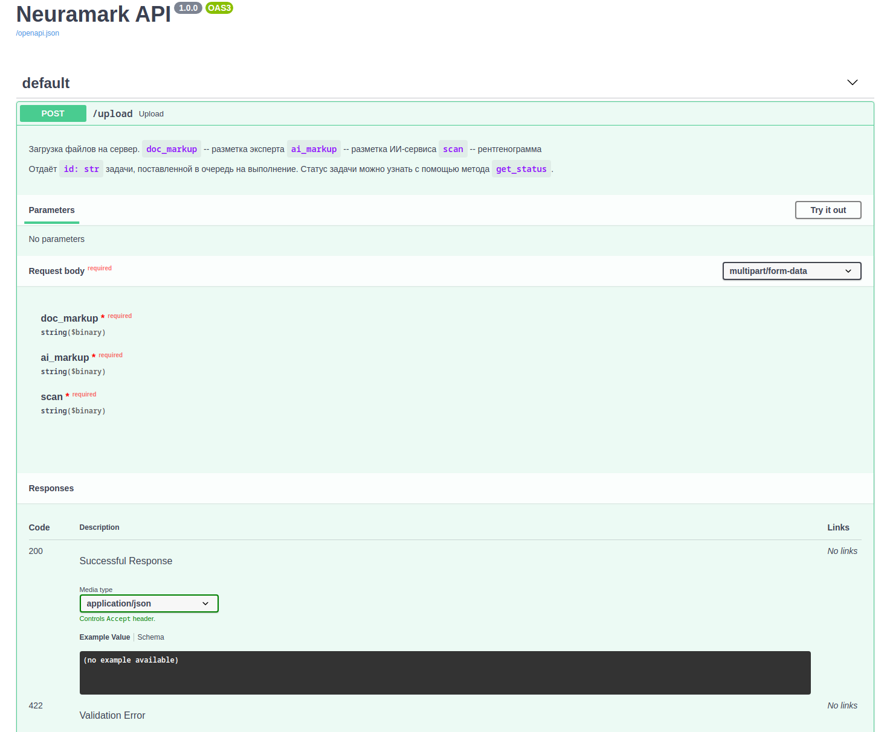

# backend

Микросервис для запуска НС на сервере. Исполлльзуемые технологии:
* `python 3.8`
* `fastapi` + `uvicorn`
* `celery` + `redis` + `RabbitMQ`
* `docker-compose` - для запуска сервиса.

При загрузке файлов ставит их в очередь и обрабатывает их с помощью ИНС.
Поддерживается распределённая работа на нескольких серверах (сервис запущен на одном сервере, а обработка происходит на разных).
Доступен только во внутренней сети микросервисов. Пользователь взаимодействует с ним через Frontend Service API.

## Настройка и запуск сервера

1. [Настройка API](#настройка-API)
1. [Запуск API](#запуск-API)
1. [Использование API:](#использование-API)

### Настройка API

Перед запуском API внесите следующие изменения в файл [docker-compose.yml](docker-compose.yml):

* `CELERY_BACKEND_URL` - URL адресс для подключения к backend-у `Celery`;
* `CELERY_BROKER_URL` - URL адресс для подключения к broker-у `Celery`;
* `USE_SOCK_FILE` - Использовать ли socket файл? Допустимые значения: True, False.

### Запуск API

Для запуска сервиса в режиме отладки выполните следующую команду в папке с проектом: `docker-compose -f compose-dev.yml up`.

Для запуска сервиса в продакшене выполните следующую команду в папке с проектом: `docker-compose up -d`.

### Использование API

При запуске в режиме отладки документация сервиса будет доступна по адресу: `127.0.0.1:8081/docs`.

На данном адресе расположен `Swagger UI`, который дает возможность опробовать `API` напрямую из web-интерфейса.

